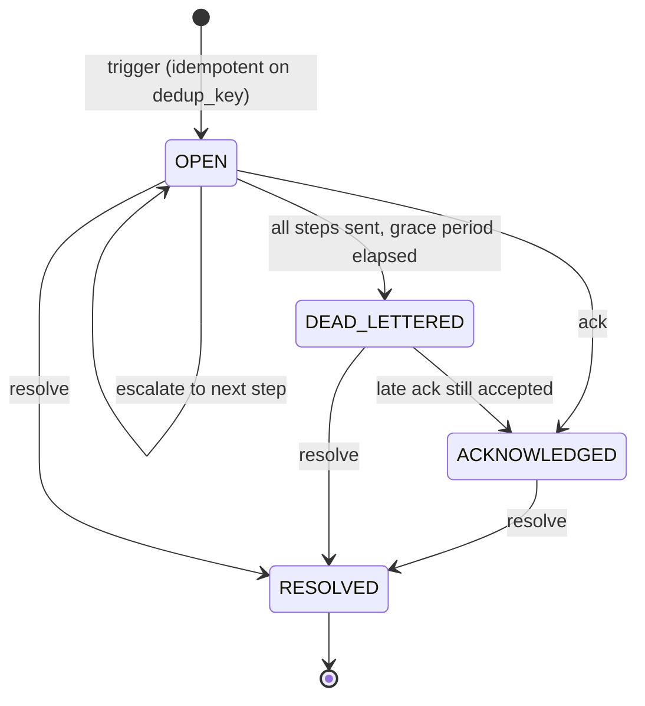
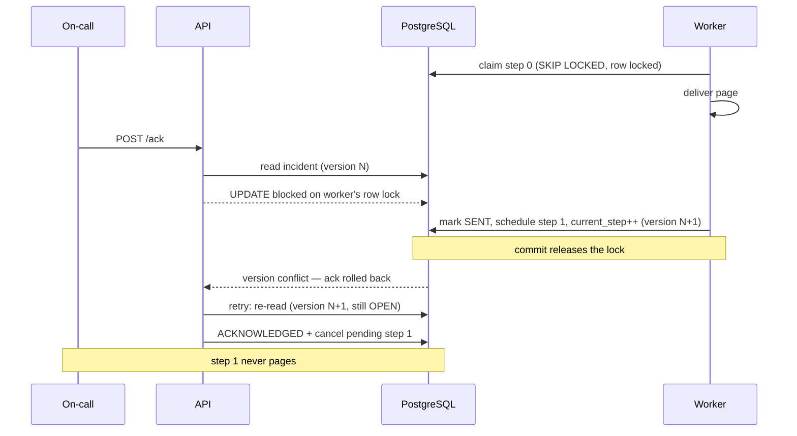

# Escalade

[](https://github.com/akshit-khandelwal47/escalade/actions/workflows/ci.yml)

A self-hostable on-call / escalation engine — the thing that decides *who gets paged, on which
channel, after how long, and what happens when nobody acknowledges*. Built to demonstrate the
delivery-guarantee mechanics that make an alerting system trustworthy, not just a CRUD wrapper
over a `notifications` table.

> **Status:** Feature-complete. All roadmap phases done — see [Roadmap](#roadmap).


*A monitoring alert fires twice (the second is deduplicated), escalation walks the policy on its own,
and acknowledging cancels the step that had not yet paged.*

## Why this is interesting

A monitoring system that pages you is only as good as its guarantees. Escalade is designed around five:

| Guarantee | Mechanism |
|---|---|
| A retried webhook never pages twice for one outage | **Idempotent create** via a partial unique index `UNIQUE (org_id, dedup_key) WHERE status='OPEN'` — enforced at the database, not by a racey `SELECT`-then-`INSERT`. |
| Multiple workers, no double-sends, no message broker | `SELECT … FOR UPDATE SKIP LOCKED` job claiming on `notification_attempt` — each worker locks a disjoint batch and skips rows another holds. |
| An ack landing exactly as the next step fires can't lose | **Optimistic locking** (`incident.version`, JPA `@Version`) — the losing transaction rolls back and retries, so an acknowledged incident never pages again. |
| A failing channel surfaces, never silently swallows a page | Capped retries + exponential backoff → an explicit, queryable `dead_letter` row. A dead channel does **not** halt the ladder: escalation continues to the next step, because a Slack outage must not stop anyone being paged. |
| "Nobody responded" is a state, not silence | When escalation runs out of steps, the incident is stamped and swept to `DEAD_LETTERED` after a grace period — late acknowledgements still work. |

## Stack

Spring Boot 3 · Java 21 · Spring Data JPA · PostgreSQL · Flyway · springdoc-openapi · Testcontainers · Docker Compose.

## Run it

### Docker (one command)

```bash
docker compose up --build
```

App on `http://localhost:8080`, Swagger UI on `http://localhost:8080/swagger-ui`. A demo org is
seeded with API key `esc_demo_key_local`.

### Local (Postgres already running)

```bash
createdb escalade
DB_USER=$(whoami) DB_PASSWORD= ESCALADE_SEED_DEMO=true ./mvnw spring-boot:run
```

## API

All `/api/**` calls require `Authorization: Bearer <org api_key>`.

| Method | Path | Purpose |
|---|---|---|
| `POST` | `/api/v1/policies` | Create an escalation policy with ordered steps |
| `GET` | `/api/v1/policies/{id}` | Fetch a policy |
| `POST` | `/api/v1/incidents` | Trigger an incident (idempotent on `dedupKey`) |
| `GET` | `/api/v1/incidents/{id}` | Incident status + full escalation timeline |
| `GET` | `/api/v1/incidents?status=OPEN` | List incidents |
| `POST` | `/api/v1/incidents/{id}/ack` | Acknowledge — halts escalation |
| `POST` | `/api/v1/incidents/{id}/resolve` | Resolve |
| `GET` | `/api/v1/dead-letters` | Deliveries that exhausted their retries |
| `POST` | `/api/v1/webhooks/inbound?policyId=` | Generic receiver — fire an incident from any monitor |
| `POST` | `/api/v1/webhooks/alertmanager?policyId=` | Prometheus Alertmanager receiver (firing triggers, resolved closes) |

### Example

```bash
KEY="esc_demo_key_local"

# 1. Create a policy: page Slack immediately, email after 30s.
POLICY=$(curl -s -X POST localhost:8080/api/v1/policies \
  -H "Authorization: Bearer $KEY" -H 'Content-Type: application/json' \
  -d '{"name":"Backend on-call","steps":[
        {"channel":"SLACK","target":"#alerts","delaySeconds":0},
        {"channel":"EMAIL","target":"oncall@example.com","delaySeconds":30}]}' | jq -r .id)

# 2. Trigger an incident.
curl -s -X POST localhost:8080/api/v1/incidents \
  -H "Authorization: Bearer $KEY" -H 'Content-Type: application/json' \
  -d "{\"policyId\":\"$POLICY\",\"title\":\"High DB latency\",\"dedupKey\":\"db-latency-prod\"}"

# 3. Fire the SAME dedupKey again — returns the same incident (HTTP 200, not 201). No duplicate page.
```

## Architecture

```mermaid
flowchart LR
    subgraph Callers
        MON[Monitoring system]
        OC[On-call engineer]
    end

    subgraph API["Escalade API"]
        INC["POST /incidents<br/>dedup on dedup_key"]
        ACK["POST /incidents/:id/ack"]
    end

    subgraph DB[(PostgreSQL)]
        I["incident<br/>status, current_step, version"]
        NA["notification_attempt<br/>status, due_at, attempt_count"]
        DL["dead_letter"]
    end

    subgraph W["Worker (n instances)"]
        CLAIM["claim due attempt<br/>FOR UPDATE SKIP LOCKED"]
        SWEEP["dead-letter sweeper"]
    end

    subgraph CH[Transports]
        SL[Slack webhook]
        EM[Email / Resend]
        LOG[Logging fallback]
    end

    MON -->|trigger| INC --> I
    INC --> NA
    OC -->|acknowledge| ACK --> I

    CLAIM -->|poll| NA
    CLAIM -->|deliver| SL & EM & LOG
    CLAIM -->|schedule next step| NA
    CLAIM -->|retries exhausted| DL
    SWEEP -->|escalation exhausted| I
```

The worker holds no state of its own: the `notification_attempt` table *is* the queue, and
`FOR UPDATE SKIP LOCKED` is what lets several instances drain it without coordinating.

### Incident lifecycle



`DEAD_LETTERED` is not an end state — it records that automated paging gave up, which is not the same
as the incident being handled. Only `RESOLVED` is terminal.

### The acknowledge race

The case the design exists for: an ack arriving while the worker is mid-delivery.



## Inbound webhooks

A monitoring system fires incidents in over `/api/v1/webhooks/*`, authenticated with the same API key
as the rest of the API. Routing is by `policyId` in the query string — the webhook URL you configure
in the monitor is what selects the escalation policy.

- **Generic** — `POST /api/v1/webhooks/inbound?policyId=<id>` with `{"title": "...", "dedupKey": "...", "payload": {...}}`.
  `dedupKey` is optional but recommended: a monitor that retries on timeout collapses onto the same
  incident instead of paging twice.
- **Prometheus Alertmanager** — `POST /api/v1/webhooks/alertmanager?policyId=<id>` accepts the native
  Alertmanager payload. Each alert's `fingerprint` becomes the dedup key, so a `firing` alert triggers
  an incident and the matching `resolved` alert **closes it automatically** — Escalade follows the
  monitor's own view, and an alert that clears on its own never needs a human to acknowledge it.

```bash
# point Alertmanager at:
#   receivers:
#     - name: escalade
#       webhook_configs:
#         - url: https://escalade.example.com/api/v1/webhooks/alertmanager?policyId=<id>
#           http_config: { authorization: { credentials: <api_key> } }
```

## Metrics

Micrometer metrics are exposed on `/actuator/metrics` and in Prometheus format on
`/actuator/prometheus`. An alerting system that cannot answer *"is it still delivering?"* has the same
problem it exists to solve, so the counters are chosen around the failure modes:

| Metric | Type | Meaning |
|---|---|---|
| `escalade_incidents_triggered_total` | counter | Incidents created |
| `escalade_incidents_deduplicated_total` | counter | Triggers that matched an open incident instead of paging again |
| `escalade_pages_sent_total{channel}` | counter | Deliveries that succeeded |
| `escalade_pages_failed_total{channel}` | counter | Deliveries that failed (before retries are exhausted) |
| `escalade_attempts_dead_lettered_total{channel}` | counter | Deliveries that exhausted their retries |
| `escalade_escalations_exhausted_total` | counter | Policies that ran out of steps unacknowledged |
| `escalade_acks_collisions_total` | counter | Acknowledgements that raced the worker and retried |
| `escalade_incidents_open` | gauge | Incidents currently escalating |
| `escalade_incidents_dead_lettered` | gauge | Incidents nobody acknowledged |
| `escalade_attempts_pending` | gauge | Attempts waiting to be delivered |
| `escalade_dead_letters` | gauge | Total dead-lettered deliveries |

`escalade_pages_failed_total` rising while `escalade_pages_sent_total` stays flat is a channel outage;
`escalade_incidents_dead_lettered` rising is a human problem, not a system one.

## Notification channels

| Channel | Transport | Activates when |
|---|---|---|
| `SLACK` | Slack incoming webhook | `SLACK_WEBHOOK_URL` is set |
| `EMAIL` | Resend HTTP API | `RESEND_API_KEY` is set |
| `WEBHOOK` | — falls back to logging | see note below |

Each transport registers only when its credential is present and non-empty; otherwise that channel
type falls back to logging the page. Whichever routing is actually in effect is logged at startup, so
a page that went to a log file instead of Slack is never a silent surprise:

```
notification routing: EMAIL=EmailNotificationChannel, SLACK=SlackNotificationChannel, WEBHOOK=LoggingNotificationChannel
```

A step's `target` is the recipient — an email address, or a Slack channel label. A step may also put
its own `hooks.slack.com` URL in `target` to page a different Slack channel per step.

`WEBHOOK` deliberately has no transport yet. Posting to a tenant-supplied URL is an SSRF sink — a
tenant could point a step at cloud instance metadata or an internal service — so it needs destination
validation (scheme, and private/link-local address ranges) before it ships, rather than being added
because the enum value exists.

## Roadmap

- [x] **0** Scaffold, Flyway, Docker Compose, Swagger
- [x] **1** Schema + migrations (all six tables + dedup/worker indexes)
- [x] **2** Policy + incident CRUD, idempotent dedup, API-key auth, state transitions
- [x] **3** Worker loop — `SKIP LOCKED` claiming + step escalation
- [x] **4** Ack-race handling — optimistic lock + concurrent test
- [x] **5** Dead-letter path + retry/backoff
- [x] **6** Real Slack + email channels
- [x] **7** Inbound webhook receiver
- [x] **8** Metrics, architecture diagram, demo GIF

## Design decisions worth asking about

- **Incremental attempt materialization.** Creating an incident inserts only the *first*
  `notification_attempt`; the worker schedules step N+1 when it sends step N. Avoids
  pre-materializing the whole ladder and makes "ack halts escalation" a single `UPDATE … WHERE status='PENDING'`.
- **At-least-once, honestly.** `SKIP LOCKED` + an external send (Slack/email) is at-least-once by
  nature — a crash after send-before-commit re-sends. Exactly-once across a system that doesn't
  dedupe is impossible; dedup is handled at the incident level instead.
- **Why no queue yet.** Postgres `SKIP LOCKED` is a perfectly good work queue at this scale. The
  swap to Kafka/SQS is a throughput/ordering decision, deferred until there's a reason.
- **A dead-lettered delivery does not stop escalation.** Exhausting retries on one step records the
  failure and moves to the next step. Halting there would let a single channel outage silently
  prevent anyone from being paged — the opposite of what a policy with multiple steps is for.
- **Delivery timeouts are a correctness concern, not tuning.** A send runs inside the transaction
  holding the attempt's row lock, so an unresponsive endpoint would pin that lock and stall the
  incident's escalation. Connect and read timeouts bound the worst case to a failed attempt that
  retries. The scale-out fix is to commit an in-flight marker and deliver outside the lock with a
  visibility timeout to recover crashed workers; bounded timeouts are sufficient while a tick is short.
- **`DEAD_LETTERED` waits out a grace period.** Marking it the instant the final step fires would make
  the status terminal while the on-call is still reading the page, so the worker stamps
  `escalation_exhausted_at` and a sweeper flips the status later. An acknowledgement is still accepted
  afterwards: the engine giving up on paging is not the same as the incident being over.
